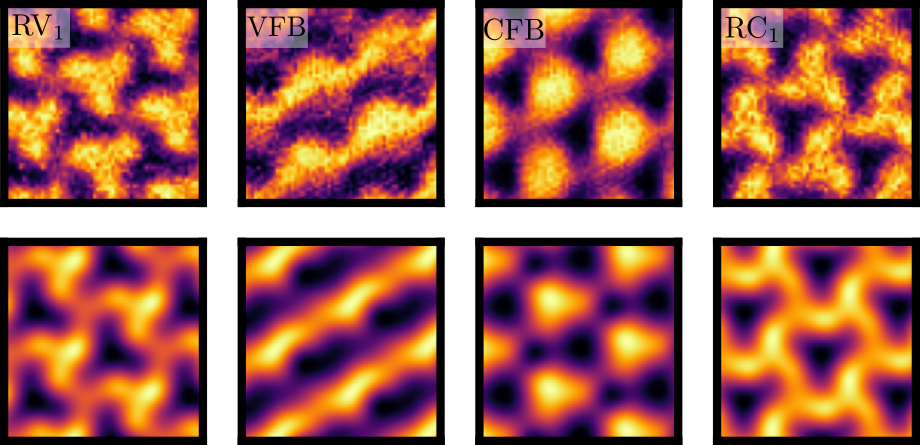

# nematic-learning
<p align="center">

</p>

---
This repository contains all the scripts used to generate and analyze the data in the paper  "Machine Learning Microscopic Form of Nematic Order in twisted double-bilayer graphene (2023)".

arxiv: [arxiv.org/abs/2302.12274](arxiv.org/abs/2302.12274).

Zenodo Link: [https://zenodo.org/record/7698738](https://zenodo.org/record/7698738).

Authors: Simon Eli Turkel ([@sturk111](https://www.github.com/sturk111)), Abhay Pasuphaty (Columbia University), Stefan Obernauer ([@stefob](https://www.github.com/stefob)), João Augusto Sobral and Mathias S. Scheurer (University of Innsbruck).

---

- [Install from Github](#install-from-github)
- [Short Instructions](#short-instructions)
- [Runtime](#runtime)
- [License](#license)

## Software requirements
### OS Requirements
The package has been tested on the following systems with Python >= 3.9: 

+ Linux: CentOS 6.8, Fedora 38 and Arch Linux

There is no required non-standard hardware.  

## Install from Github

 ```
 git clone https://github.com/joaosds/nematic-learning
 ```
 
In case you need the dependencies:

 ```
 cd nematic-learning
 pip install -r requirements.txt
 ```

## Short Instructions

### Continuum model for tDBG

1. TDBG.py is a variation of [pytwist](https://github.com/sturk111/pytwist) that contains the graphene and moiré nematic couplings. For further documentation we refer 
to the original repository - that goes beyond tDBG by including other moiré heterostructures.

### Toy model for TBG

2. Files for the investigations in Appendix D can be found in the folder `app_d` and some auxiliary *Mathematica* notebooks in `minimalmodel/matnb`.

#### Eperimental $D_{\text{exp}}$ and theoretical $D_{\text{th}}$ datasets

3. The raw data for the experimental dataset $D_{\text{exp}}$ can be found in the folder `expdata`. To see how you can access and preprocess it, take a look 
at `expdata_preprocessing.py`.
4. All test datasets (npz files) and corresponding trained model files (h5) to reproduce the plots in the paper can be found in the Zenodo link.
5. A typical code for the ML procedure is found in `mlexample.py` (in this case with the corresponding file "sec2e_test.npz" in the same folder, you can reproduce the plots for for Section "Including Strain" in the main text);
7. Auxiliary scripts can be found in the folder `utils`. These consist of options to concatenate datasets generated by `mpsingle.py`, map the 
current labels to different ones (such as $\beta =\{\varphi\} \rightarrow \beta^{\prime} = \{\sin\left(\varphi\right), \cos\left(\varphi\right)\}$), and just  check the dimensions of 
the `npz` files.
 ## Runtime 
- Typical install time should not exceed a few minutes. Runtime should not also not exceed a few minutes when using only test datasets to reproduce the plots in the paper.

- The time to train and create datasets from scratch is dependent on your hardware configuration. We used the set of clusters from the University of Innsbruck (UIBK) (https://www.uibk.ac.at/th-physik/howto/hpc/regulus.html) for (i) producing the datasets and (ii) training the ML models. For each run, we typically reserve 40GB of RAM. The specific CPU from the clusters depends on their availability. Although we did not test the computational cost systematically, we also ran the codes on two personal computers A and B which can
represent low and high-end performing cases with the following hardware:
```
• Computer A: (CPU) AMD Ryzen 7 5800H with Radeon Graphics (16) @ 3.200GHz, (GPU 1):
AMD ATI Radeon Vega Series / Radeon Vega Mobile Series, (GPU 2): NVIDIA GeForce RTX
3060 Mobile / Max-Q, 16 GB of RAM.
• Computer B: (CPU) Intel i5-7200U (4) @ 2500GHz, (GPU) Intel HD Graphics 620, 12GB of RAM.
```
For instance, training the model we show the loss curve of in Supplementary Fig. 5a takes around 2, 6, and 9 hours on the cluster, computers A and B with the adoption of the EarlyStoppping module from [keras-tensorflow](https://github.com/keras-team/keras) with a patience parameter of ~50 and 2000 epochs.

- Time for creating datasets: The typical computational bottleneck we found lies in generating the datasets since the continuum model diagonalization for moir systems can be computationally demanding. Producing 1000 samples with both $\mathcal{D}(\omega)$ and $\mathcal{D}(\bf{r})$ channels can take around 12 hours in a setup similar to computer B. Consequently, creating any dataset with 12000 samples from the main sections could take up to one week. In a parallelized environment such as the set of clusters from UIBK, we could generate these datasets reliably in around 13 hours.

## Citation 

If you use this code in your work, you can also cite the associated paper with 

```
@article{Sobral2023,
  doi = {10.1038/s41467-023-40684-1},
  url = {https://doi.org/10.1038/s41467-023-40684-1},
  year = {2023},
  month = aug,
  publisher = {Springer Science and Business Media {LLC}},
  volume = {14},
  number = {1},
  author = {Jo{\~{a}}o Augusto Sobral and Stefan Obernauer and Simon Turkel and Abhay N. Pasupathy and Mathias S. Scheurer},
  title = {Machine learning the microscopic form of nematic order in twisted double-bilayer graphene},
  journal = {Nature Communications}
}
```
## License

Shield: [![CC BY 4.0][cc-by-shield]][cc-by]

This work is licensed under a
[Creative Commons Attribution 4.0 International License][cc-by].

[![CC BY 4.0][cc-by-image]][cc-by]

[cc-by]: http://creativecommons.org/licenses/by/4.0/
[cc-by-image]: https://i.creativecommons.org/l/by/4.0/88x31.png
[cc-by-shield]: https://img.shields.io/badge/License-CC%20BY%204.0-lightgrey.svg

